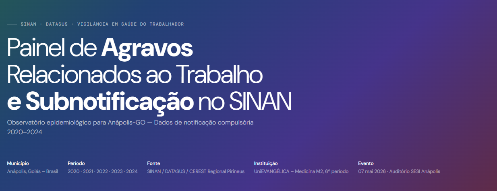

# Painel SINAN: Agravos Relacionados ao Trabalho – Anápolis-GO



**Observatório Epidemiológico e Análise de Subnotificação (2020–2024)**

Este projeto é um painel interativo de visualização de dados epidemiológicos focado nos agravos à saúde relacionados ao trabalho no município de Anápolis, Goiás. Desenvolvido como parte do **Projeto de Saúde Coletiva (PSC)** do curso de Medicina da **UniEVANGÉLICA**, a ferramenta visa dar visibilidade aos dados do SINAN (Sistema de Informação de Agravos de Notificação) e evidenciar o impacto da subnotificação na vigilância em saúde do trabalhador.

---

## 🎯 Objetivos do Projeto

- **Sistematizar dados**: Organizar as notificações compulsórias de 2020 a 2024 de forma acessível e visual.
- **Evidenciar a Subnotificação**: Comparar dados registrados com estimativas reais para sensibilizar sobre a importância da notificação compulsória.
- **Apoio à Gestão**: Subsidiar sindicatos, profissionais de saúde e gestores públicos com evidências para a tomada de decisão.
- **Educação em Saúde**: Promover a cultura da vigilância epidemiológica entre acadêmicos e a comunidade.

## 📊 Seções de Análise

O painel está dividido em módulos específicos para diferentes tipos de agravos:
1.  **Visão Geral**: Panorama completo, indicadores de tendência e distribuição por setor econômico.
2.  **LER/DORT & Dermatoses**: Foco em doenças osteomusculares e dermatológicas.
3.  **Acidentes de Trabalho**: Análise de acidentes graves e por animais peçonhentos.
4.  **Biológico & Câncer**: Exposição a material biológico e neoplasias ocupacionais.
5.  **Auditiva & Intoxicação**: Perda auditiva induzida por ruído (PAIR) e intoxicações exógenas.
6.  **Transtornos Mentais**: Burnout, depressão e ansiedade relacionados ao trabalho.
7.  **Pneumoconioses**: Doenças pulmonares ocupacionais e sua latência.

## 🛠️ Tecnologias Utilizadas

O projeto utiliza uma arquitetura moderna e escalável:
- **[Vite](https://vitejs.dev/)**: Ferramenta de build e servidor de desenvolvimento de alta performance.
- **[Chart.js](https://www.chartjs.org/)**: Motor de visualização de dados para gráficos interativos.
- **JavaScript (ES6+)**: Lógica modularizada para manutenção simplificada.
- **CSS3 Variables**: Sistema de design consistente com foco em acessibilidade e responsividade.

## 🚀 Como Executar

### Pré-requisitos
- [Node.js](https://nodejs.org/) (versão 18 ou superior)
- [npm](https://www.npmjs.com/)

### Instalação e Desenvolvimento
1.  Clone o repositório:
    ```bash
    git clone https://github.com/g3rley/painel-agravos-anapolis.git
    cd painel-agravos-anapolis
    ```
2.  Instale as dependências:
    ```bash
    npm install
    ```
3.  Inicie o servidor de desenvolvimento:
    ```bash
    npm run dev
    ```
4.  Abra o navegador em `http://localhost:5173`.

## 📚 Fontes de Dados

Os dados apresentados são baseados em:
- **SINAN / DATASUS**: Sistema de Informação de Agravos de Notificação.
- **CEREST Regional Pirineus**: Centro de Referência em Saúde do Trabalhador de Anápolis.
- **Portaria GM/MS nº 5.201/2024**: Lista Nacional de Notificação Compulsória.

## 👥 Equipe e Realização

**Instituição**: Universidade Evangélica de Goiás (UniEVANGÉLICA)
**Curso**: Medicina (M2, 6º Período)
**Orientação**: Gerley Adriano Miranda Cruz

**Acadêmicos**:
- João Vitor de Oliveira Rodrigues (Líder)
- Ana Paula Beirigo Barbosa
- Felipe Fonseca Costa
- Fernanda Teixeira
- Gabriella Rosa Rodrigues Dutra
- Geovanna Vitória Souza Rodrigues
- Isadora Morais Dias
- Marcus Kalyel Ferreira Godoi
- Pedro Augusto Silva Resende
- Vitória Tomé Jacinto
- Wesley Lima Guimarães

---
*Apresentado em 07 de maio de 2026 no Auditório do SESI, Anápolis-GO.*
